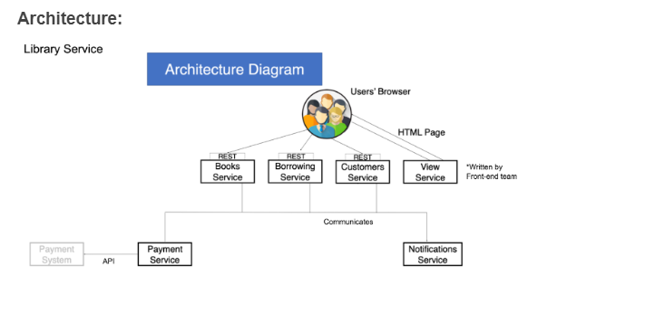
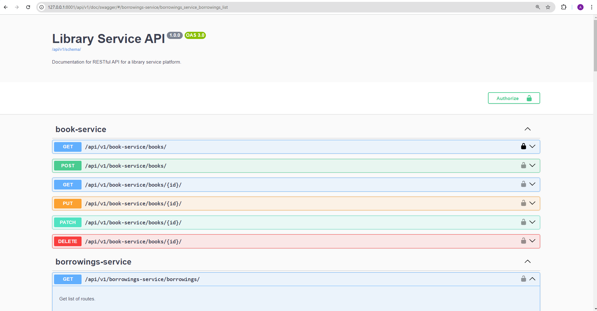
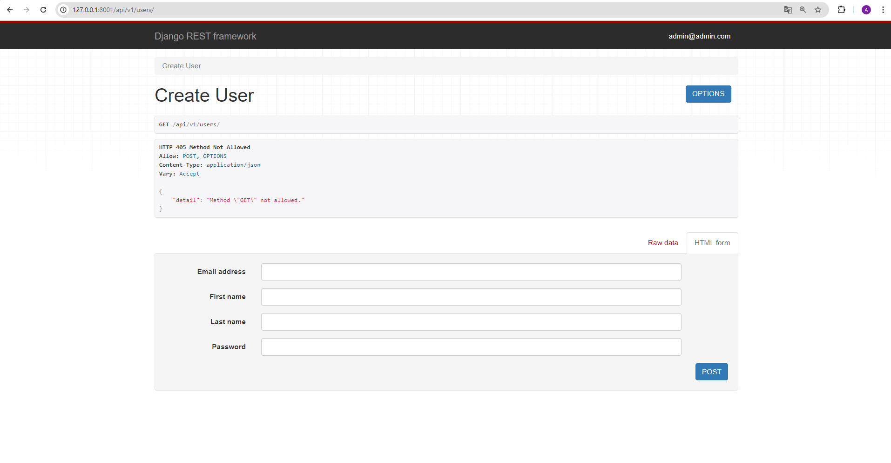
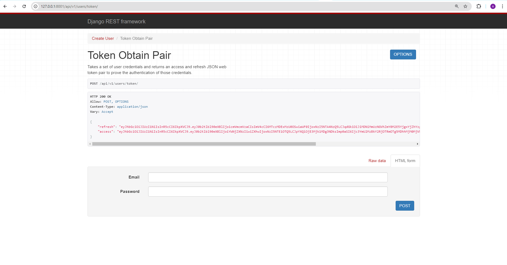
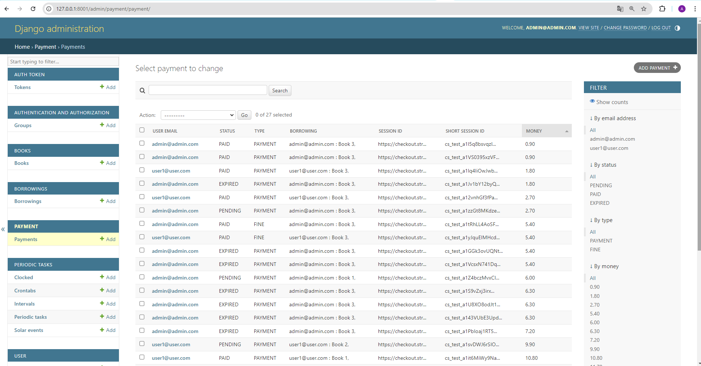

"# library-service" 

API service for library management system written on DRF,
in which Admin can manage books and users borrowings, including payment processes.
Users can create account to borrowing books.
The structure od database you can see: 



## Installing / Getting started

Python3 must be already installed
Docker must be already installed and running

```shell
git clone https://github.com/Anton-Konyk/library-service
cd library_service_api
Python3 -n venv venv
source venv/bin/activate (for MacOS/Linux) or venv/scripts/activate (for Windows)
pip install -r requirenents.txt
create .env file (see example: [example.env](example.env) )
docker-compose build
docker-compose up
http://127.0.0.1:8001/api/v1/doc/swagger/  # API documentation

If you need create superuser account:
# After docker-compose up
docker ps
docker exec -it <CONTAINER ID for library_service_api-library_service or Name> bash 
# example: docker exec -it library_service_api-library_service-1 bash
python manage.py createsuperuser
# after creating superuser
exit
```

## Features

* JWT authentication functionality for User (email and password for first registration)
* 
* 
* Manage books inventory:
- Is Admin users can create/update/delete books
- All users (even those not authenticated) can see to list books
* Manage books borrowing:
- borrowings are available only for authenticated users
- all non-admins can see only their borrowings
- the `is_active` parameter for filtering by active/not active 
  borrowings (still not returned/ returned)
-  the `user_id` parameter for admin users, so admin can see all users’ borrowings, 
  if not specified, but if specified - only for concrete user
- automatically notifications to the Telegram chat to a new borrowing, 
  automatically checking all borrows which are overdue (expected_return_date is tomorrow 
  or less, and the book is still not returned) and sends a notification to the
  Telegram chat about each overdue separately with detailed information.
  If no borrowings are overdue for that day - sends a “No borrowings overdue today!” 
  notification.
* Powerful admin panel for advanced management 
* Handle payments by Stripe:
- Calculate the total price of borrowing and set it as the unit amount
- Automatically creation payment for a new borrowing
- Automatically scheduled task for checking Stripe Session for expiration
- User can to renew the Payment session
- Users can't to borrow new books if at least one pending payment for the user
- Create a FINE Payment with some preconfigured FINE_MULTIPLIER
- If payment was paid - automatically send the notification to the Telegram chat


## Contributing

It's open source code.
If you'd like to contribute, please fork the repository and use a feature
branch. Pull requests are warmly welcome.


## Demo


